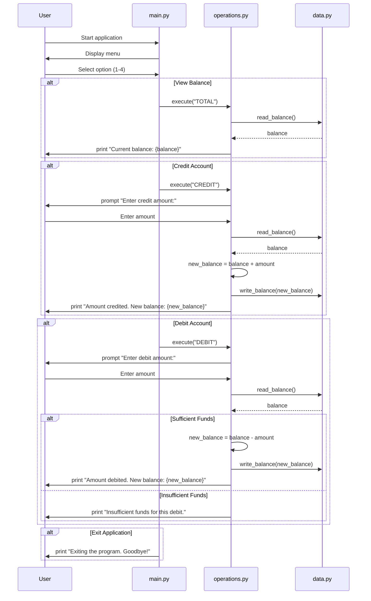

# Modernizing a COBOL Accounting System to Python (with Tests & Coverage)

This repository contains a Python reimplementation of a simple COBOL accounting system.
The goal is to modernize the legacy code with a clean Python structure, clear docstrings,
and a comprehensive automated test suite (pytest) aligned with the business test plan using github copilot.

## Prerequisites

- Python 3.11+ (tested on 3.12)
- pip (ou `apt` pour les paquets Debian/Ubuntu)
- pytest

## Project Structure

```
├── README.md
├── TESTPLAN.md
├── data.py
├── main.py
├── operations.py
├── pytest.ini
  └── tests
    ├── conftest.py
    ├── test_main.py
    └── test_operations.py
```

## About the program

This Python program simulates an **account management system**.  
It allows the user to perform basic operations such as crediting, debiting, viewing the balance, and exiting the application.

The project is structured into clear, modular files:

- **Main Program (`main.py`)**:  
  Handles the user interface (text-based menu), takes user input, and dispatches operations.

- **Operations Module (`operations.py`)**:  
  Contains the business logic for account operations (credit, debit, view balance) and the execution dispatcher.

- **Data Module (`data.py`)**:  
  Provides in-memory storage of the account balance and functions to read/update it, using `decimal.Decimal` for accuracy.

- **Tests (`tests/`)**:  
  Automated tests written with `pytest`, covering all functionalities defined in the business test plan (`TESTPLAN.md`).

## Steps to Run the Program

Unlike the original COBOL version, no compilation is required.  
The system is implemented in pure Python and can be executed directly.

### 1. Make sure Python 3 is installed

Check your Python version:

````bash
python3 --version

python3 main.py

## Program Interaction Example

- Program starts with user input menu

```bash
--------------------------------
Account Management System
1. View Balance
2. Credit Account
3. Debit Account
4. Exit
--------------------------------
Enter your choice (1-4):
````

- User Chooses to View Balance:

```bash
Current balance: 1000.00
```

- User Chooses to Credit:

```bash
Enter credit amount:
200.00
Amount credited. New balance: 1200.00
```

- User Chooses to Debit:

```bash
Enter debit amount:
300.00
Amount debited. New balance: 900.00
```

- User Chooses to Exit:

```bash
Exiting the program. Goodbye!
```

## Explanation

- **main.py**: Provides the main interface where users interact with a simple text-based menu to select operations.
- **operations.py**: Contains the core business logic, handling specific operations such as viewing the balance, crediting, and debiting the account.
- **data.py**: Acts as a simple in-memory data storage, with functions to read and update the account balance using `decimal.Decimal` for precision.
- **tests/**: Contains the automated test suite (`pytest`) that validates each operation against the business test plan.

This multi-file structure ensures modularity, making the program easier to maintain, extend, and test.  
Each file has a clear responsibility, and the program flow is driven by user interaction, with full coverage through automated testing.

### Data flow

The Python program follows a modular flow:

main.py displays the menu, reads user input, and dispatches actions.

operations.py implements the business logic for TOTAL, CREDIT, and DEBIT.

data.py stores the account balance in memory and provides read/write functions.

Here’s the data flow illustrated in Mermaid format:



## Tests

The project includes a full **business test plan** (see [TESTPLAN.md](./TESTPLAN.md)) and an automated **pytest** suite.

### Test Plan

- The business logic has been mapped into test cases (TC-1.1 → TC-9.10).
- Each test case follows the structure: ID, Description, Pre-conditions, Steps, Expected Result, Actual Result, Status.
- The test plan ensures coverage of:
  - Viewing the balance
  - Crediting the account
  - Debiting the account
  - Exiting the application
  - Edge cases (invalid input, whitespace, negative values, insufficient funds, large numbers, sequential scenarios, etc.)

### Automated Tests

- All test cases are implemented in the `tests/` directory.
- Tests are written with **pytest**.
- Coverage is tracked with **pytest-cov**.

Run the tests:

```bash
pytest
```

### Exemple output

```
==================================== test session starts ====================================
collected 59 items

tests/test_main.py ..........
tests/test_operations.py .....................................................

---------- coverage: platform linux, python 3.12 ----------
Name                Stmts   Miss  Cover
---------------------------------------
data.py                 7      0   100%
main.py                24      0   100%
operations.py          43      0   100%
---------------------------------------
TOTAL                  74      0   100%
===================================== 59 passed in 0.20s ====================================

```
